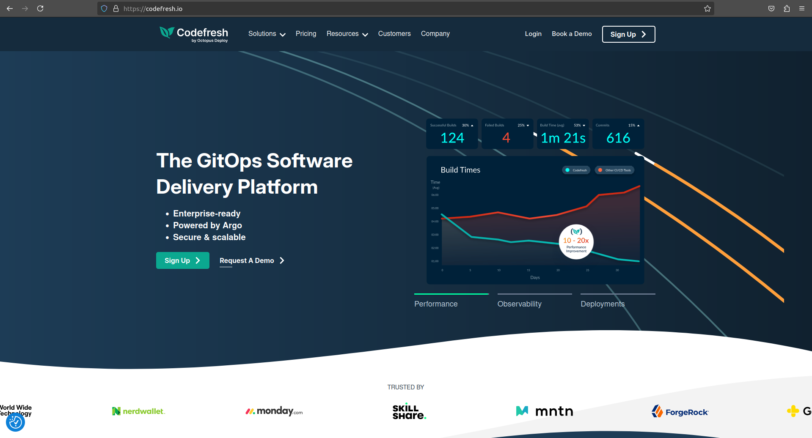
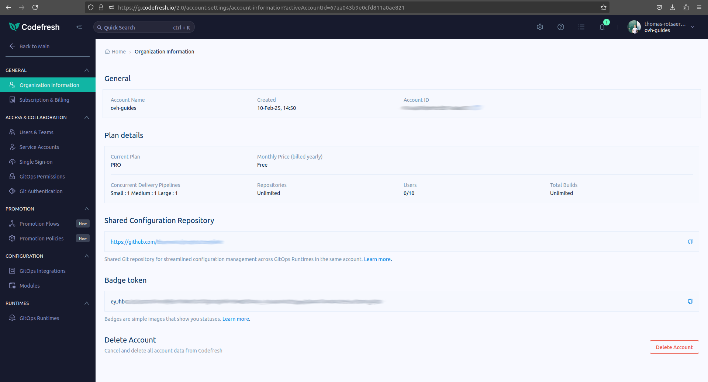
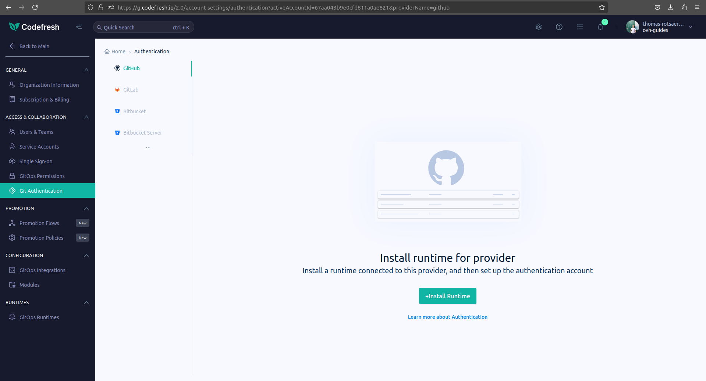
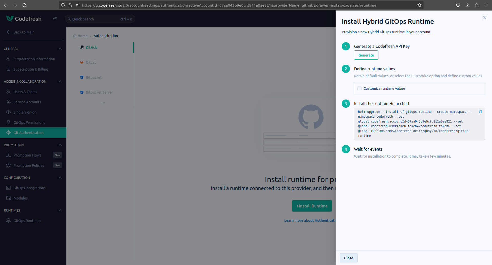

In this tutorial we will see how you can connect [Codefresh](https://codefresh.io){.external}, a CI/CD platform for Kubernetes, to an OVHcloud Managed Kubernetes cluster.

## Before you begin

The first thing you need to follow this tutorial is a Codefresh account, you can get it directly at [Codefresh](https://codefresh.io){.external} site.

{.thumbnail}

You will also need Helm and CLI tool *kubectl* to be installed on your local machine

Please refer to the official Helm webpage for installation : [Install Helm](https://helm.sh/){.external}

This tutorial also presupposes that you already have a working OVHcloud Managed Kubernetes cluster, and some basic knowledge of how to operate it. If you want to know more on those topics, please look at the [OVHcloud Managed Kubernetes Service Quickstart](/pages/public_cloud/containers_orchestration/managed_kubernetes/deploying-hello-world).

## Connect an OVH Kubernetes cluster to Codefresh dashboard

You can use the Codefresh GUI to connect your OVHcloud Managed Kubernetes cluster to Codefresh. 
On the first section called *Integrations* click the *Configure* button next to Kubernetes.
In Codefresh GUI, start by going into your *Account Configuration*, by clicking on the small cog in the top right corner. 
On the navbar at the left, click on *Git Authentication*, then on *Install Runtime* on your favorite Git Service.
Then, you'll have to define the repository you want to work on and the engine you're using. Click on *Continue*.
Generate your API Key, and an Helm command will appear. Copy and paste this command into a terminal where you have exported your Kubeconfig before.

This Helm chart will install all the needed resources on your cluster such as ServiceAccounts, Deployments, etc...

{.thumbnail}

{.thumbnail}

{.thumbnail}

```bash 
$ kubectl get all -n codefresh
NAME                                                     READY   STATUS             RESTARTS      AGE
pod/argo-cd-application-controller-0                     1/1     Running            0             2m21s
pod/argo-cd-applicationset-controller-5474d545d9-m6p7b   1/1     Running            0             2m19s
pod/argo-cd-dex-server-68d88f58b7-mhm8v                  1/1     Running            2 (88s ago)   2m20s
[...]

NAME                                        TYPE        CLUSTER-IP     EXTERNAL-IP   PORT(S)             AGE
service/argo-cd-applicationset-controller   ClusterIP   10.3.237.34    <none>        7000/TCP            2m25s
service/argo-cd-dex-server                  ClusterIP   10.3.67.97     <none>        5556/TCP,5557/TCP   2m24s
service/argo-cd-redis                       ClusterIP   10.3.62.230    <none>        6379/TCP            2m24s
[...]

NAME                                                READY   UP-TO-DATE   AVAILABLE   AGE
deployment.apps/argo-cd-applicationset-controller   1/1     1            1           2m23s
deployment.apps/argo-cd-dex-server                  1/1     1            1           2m23s
deployment.apps/argo-cd-redis                       1/1     1            1           2m23s
[...]

NAME                                                           DESIRED   CURRENT   READY   AGE
replicaset.apps/argo-cd-applicationset-controller-5474d545d9   1         1         1       2m20s
replicaset.apps/argo-cd-dex-server-68d88f58b7                  1         1         1       2m22s
replicaset.apps/argo-cd-redis-55dcd4d7cd                       1         1         1       2m20s
[...]

NAME                                              READY   AGE
statefulset.apps/argo-cd-application-controller   1/1     2m23s
statefulset.apps/argo-cd-event-reporter           0/3     2m23s
```

The integration between Codefresh and your Kubernetes cluster is API based and relies on a Kubernetes service account of your choosing that will be used to manage the integration.

### Test and save the connection


Click on the *Test connection* button to test the configuration. You should get a message telling you that your OVHcloud Managed Kubernetes cluster connects successfully with Codefresh:

{.thumbnail}

Then click on *Save* to save your cluster on your Codefresh Dashboard.

### And now?

Now you can follow [Codefresh official tutorial](https://codefresh.io/docs/docs/getting-started/deployment-to-kubernetes-quick-start-guide/){.external} to deploy a Docker image to a Kubernetes cluster and also how to setup an automated pipeline to automatically redeploy it when the source code changes.

{.thumbnail}

## Go further

- If you need training or technical assistance to implement our solutions, contact your sales representative or click on [this link](https://www.ovhcloud.com/en-gb/professional-services/) to get a quote and ask our Professional Services experts for assisting you on your specific use case of your project.

- Join our [community of users](https://community.ovh.com/en/).
