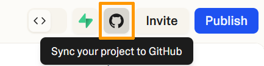

## Objectif

[Lovable.dev](https://lovable.dev) est un outils qui permet de générer des sites web à partir de prompts. Ce guide vous explique comment importer et publier un site web généré via Lovable sur un **hébergement mutualisé OVHcloud**.  

## Prérequis

- Disposer d'un [hébergement mutualisé OVHcloud](/links/web/hosting)
- Posséder un compte sur [Lovable.dev](https://lovable.dev)

## En pratique

> [!warning]
>
> Les hébergements mutualisés OVHcloud sont compatibles uniquement avec les bases de données MySQL/MariaDB. Si votre site web généré via Lovable.dev utilise une base de données PostgreSQL ou un backend Node.js, il ne pourra pas fonctionner sur ce type d’hébergement.
>
> En revanche, si votre site est 100 % statique (HTML, CSS, JS), vous pouvez l’importer sans problème sur un hébergement web OVHcloud.

### Étape 1 : Générer votre site web sur Lovable.dev

1. Rendez-vous sur [https://lovable.dev](https://lovable.dev).
2. Créez un compte si ce n'est pas déjà fait.
3. Entrez votre prompt pour générer votre site web.

> [!warning]
>
> Lovable supporte uniquement les bases de données PostgreSQL. Etant compatibles uniquement avec les SGBD MySQL et MariaDB, votre hébergement mutualisé OVHcloud ne pourra pas se connecter avec votre base de données. Générez uniquement des sites web statiques.

**Exemples de prompts compatibles**

- « Crée une page de présentation personnelle en HTML, CSS et JavaScript, sans base de données »
- « Conçois un site vitrine pour une boulangerie, uniquement en HTML et CSS »
- « Génère une landing page statique avec un formulaire de contact en JavaScript (sans serveur) »
- « Crée un site statique responsive pour un produit SaaS, sans backend »

> [!primary]
>
> Si vous mentionnez un formulaire ou une fonctionnalité interactive, précisez qu’il ne doit pas y avoir de serveur ou de base de données.

**Prompts à éviter**

Évitez les demandes qui entraîneraient la création de backend ou de bases de données :

- « Crée une application avec connexion utilisateur et base PostgreSQL »
- « Génère un blog avec Node.js et Express »
- « Conçois un site de e-commerce avec panier, base de données et interface d’administration »

### Étape 2 : Exporter votre site web via GitHub

Une fois votre site web généré par Lovable, exportez-le via GitHub. Dans l'interface principale de Lovable.dev, cliquez en haut à droite sur l'icône de Github (`Sync your project to GitHub`).

{.thumbnail}

Pour connecter votre compte Lovable à GitHub, suivez la documentation officielle de [Lovable.dev](https://lovable.dev/integrations/github).

Une fois le processus terminé, un nouveau dépôt contenant le code de votre site web est présent dans votre compte GitHub.

### Étape 3 : Récupérer le code depuis GitHub

Accédez au dépôt GitHub contenant le code de votre site web. Cliquez sur `Code`{.action} puis sur `Download ZIP`{.action}.

> [!note]
> Si le dépôt GitHub contient un dossier `build`, vous pouvez utiliser ce dossier tel quel. C’est ce dossier que vous devez envoyer sur votre hébergement.
> 
> Si le dépôt ne contient **que du code source React** (avec un dossier `src/`, un fichier `package.json`, etc.), vous ne pourrez pas l’utiliser sur un hébergement mutualisé OVHcloud sans d’abord le transformer en site statique.
> 
> Cette étape nécessite des connaissances techniques (Node.js, npm). Si vous n’êtes pas à l’aise avec ces outils, nous vous conseillons de régénérer un site plus simple depuis Lovable.dev, en précisant dans votre prompt que vous souhaitez un **site statique sans React**.
